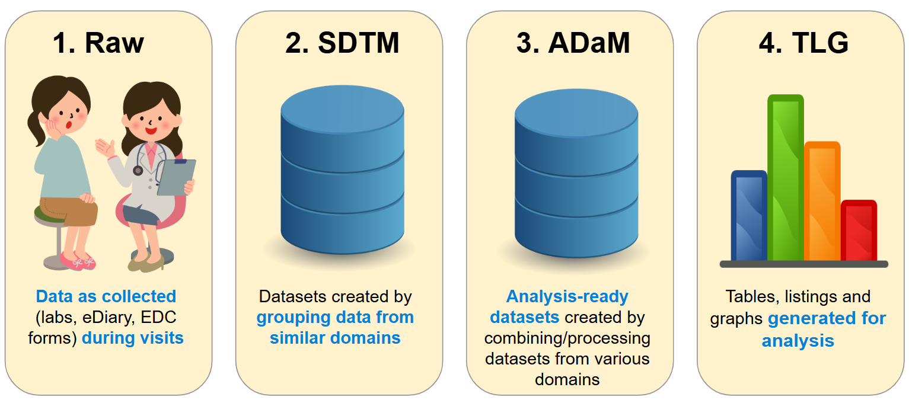
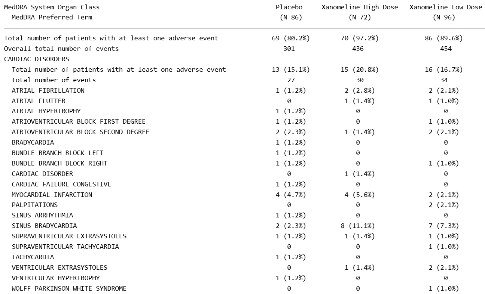
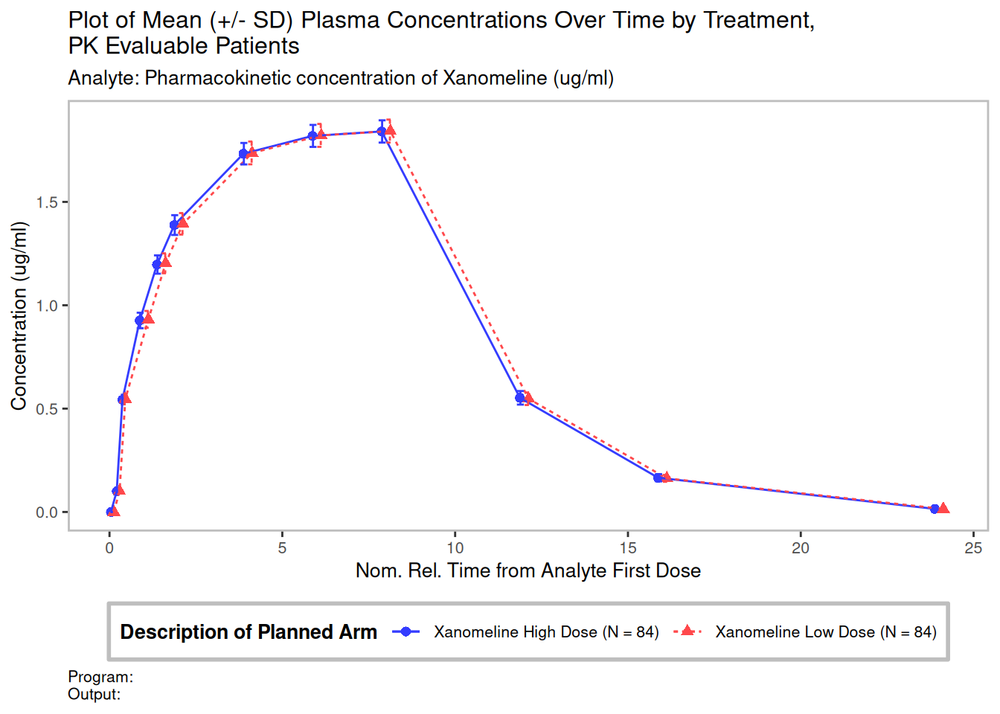

## Welcome!

::: fragment
**What we'll do today:**

1.  Understand the clinical trial data flow
2.  Derive analysis variables on real-format study data
3.  Build a publication-quality visualisation
:::

::: fragment
::: {.callout-note title="Workshop materials"}
For slides, template and data, please see the workshop GitHub repo [here](https://github.com/manciniedoardo/clinical_programming_in_R_workshop).
:::
:::

::: fragment
Please install the following packages in R while we go through the background section:
```{r, eval=FALSE}
install.packages("pharmaversesdtm") # test data
install.packages("admiral") # tools for ADaM programming
install.packages("ggplot2") # plots
```
:::
------------------------------------------------------------------------

## Agenda

We have a lot to cover!

::: fragment
| Time | Topic                                         |
|------|-----------------------------------------------|
| 0:00 | Background: The clinical trial data journey   |
| 0:15 | Test data and the packages we'll be using     |
| 0:20 | **Exercise 1** — ADSL derivations             |
| 1:00 | **Exercise 2** — ADVS: deriving MAP           |
| 1:30 | **Exercise 3** — Plotting MAP over time       |
| 1:55 | Wrap-up and next steps                        |
:::

------------------------------------------------------------------------

## Background: The Clinical Trial Data Journey

::: fragment
The journey of a data point from a patient to a regulator's report is long and complex! it can loosely be categorised into four stages:
:::

::: fragment
{width="90%" fig-align="center"}
:::

::: fragment
[*Let's go through these stages one by one...*]({style="color:blue;"})
:::

------------------------------------------------------------------------

## 1. Raw Data — Where it all begins!

::: fragment
Data enters a clinical trial from many sources:

-   **eDiary / CRF (case report form)**: clinician- or patient-reported data (e.g. adverse events, concomitant medications, etc)
-   **Central labs**: blood tests, urinalysis
-   **Wearables / devices**: ECG, vital signs monitors
:::

::: fragment
:::{.callout-caution title="Raw data is messy!"}
-   Different units, different date formats
-   Inconsistent coding (a "heart attack" might be "MI", "myocardial
infarction", or "cardiac event")
-   Missing or partial dates
:::
:::

::: fragment
[*So we process raw data into...*]({style="color:blue;"})
:::

------------------------------------------------------------------------

## 2. SDTM — Standardising the data

::: fragment
**SDTM** (Study Data Tabulation Model) groups similar, related data into **domains**. Here are some below.

| Domain | Contents               |
|--------|------------------------|
| `DM`   | Demographics           |
| `VS`   | Vital Signs            |
| `LB`   | Laboratory             |
| `AE`   | Adverse Events         |
| `EX`   | Exposure (drug dosing) |

E.g. the labs domain groups all the blood tests, urinalysis etc into one dataset.
:::

::: fragment
:::{.callout-tip title="Key features of SDTM"}
- One row per observation, e.g.:
  - In `DM`: one row per patient
  - In `LB`: one row per patient per lab test per visit;
  - In `AE`: one row per patient per adverse event
- Standard variable names across all studies
- Standardised units
- Data is coded where appropriate (e.g. "Heart attack", "Cardiac arrest" → "Myocardial Infarction").
:::
:::

::: fragment
[*Let's see some examples...*]({style="color:blue;"})
:::


------------------------------------------------------------------------

## SDTM in action: DM & EX

::::: columns
::: {.column width="40%"}
::: fragment
**DM (Demographics)** — one row per patient

```{r}
#| eval: true
#| echo: false
#| class-output: "small-table"
library(pharmaversesdtm)
library(dplyr)
library(knitr)

vars <- c("USUBJID", "AGE", "RACE", "COUNTRY", "ARM")
labs <- sapply(dm[vars], attr, "label")
dm %>%
  select(all_of(vars)) %>%
  head(10) %>%
  kable(format = "html",
        col.names = paste0(vars, "<br><em>", labs, "</em>"),
        escape = FALSE,
        table.attr = 'style="font-size:0.65em"')
```
:::
:::

::: {.column width="6%"}
:::

::: {.column width="54%"}
::: fragment
**EX (Drug Exposure)** — one row per patient per dosing

```{r}
#| eval: true
#| echo: false
#| class-output: "small-table"
vars <- c("USUBJID", "EXTRT", "VISIT", "EXSTDTC", "EXDOSE")
labs <- sapply(ex[vars], attr, "label")
ex %>%
select(all_of(vars)) %>%
head(10) %>%
kable(format = "html",
col.names = paste0(vars, "<br><em>", labs, "</em>"),
escape = FALSE,
table.attr = 'style="font-size:0.65em"')
```
:::
:::
:::::

------------------------------------------------------------------------

## SDTM in action: AE & VS

::::: columns
::: {.column width="46%"}
::: fragment
**AE (Adverse Events)** — one row per patient per adverse event

```{r}
#| eval: true
#| echo: false
vars <- c("USUBJID", "AEDECOD", "AESER", "AESEV", "AESTDTC")
labs <- sapply(ae[vars], attr, "label") %>% 
  stringr::str_replace("/", "/ ")

ae %>%
  select(all_of(vars)) %>%
  head(9) %>%
  kable(format = "html",
        col.names = paste0(vars, "<br><em>", labs, "</em>"),
        escape = FALSE,
        table.attr = 'style="font-size:0.65em"')
```
:::
:::

::: {.column width="4%"}
:::

::: {.column width="50%"}
::: fragment
**VS (Vital Signs)** — one row per patient per vital sign measurement

```{r}
#| eval: true
#| echo: false
vs_vars <- c("USUBJID", "VSTESTCD", "VSORRES", "VSORRESU", "VISIT")
vs_labs <- sapply(vs[vs_vars], attr, "label")
vs %>%
  mutate(VISIT = stringr::str_replace(VISIT, "SCREENING", "SCREEN")) %>% 
  filter(
  (VSTESTCD %in% c("HEIGHT")) | (VSTESTCD %in% c("PULSE") & VSPOS %in% c("STANDING")) & VSELTM %in% c("PT1M"),
  !stringr::str_detect(VISIT, "AMBUL")
  ) %>%
select(all_of(vs_vars)) %>%
head(16) %>%
kable(format = "html",
col.names = paste0(vs_vars, "<br><em>", vs_labs, "</em>"),
escape = FALSE,
table.attr = 'style="font-size:0.65em"')
```
:::
:::
:::::

::: fragment
[*But what if we want to combine data from different domains or compute new variables for analysis?*]({style="color:blue;"})
:::

------------------------------------------------------------------------

## 3. ADaM — Analysis-ready datasets

::: fragment
**ADaM** (Analysis Data Model) transforms and combines SDTM into datasets ready for
statistical analysis.

The step from SDTM to ADaM can involve complex programming, as we are trying to __set up the data to answer the questions about safety and efficacy that the clinical trial is posing__, and this often involves combining domains.
:::

::: fragment
:::{.callout-note title="A typical example"}
We may be interested in exploring whether patients are likely to have an adverse event after being exposed to the drug. So in ADAE (Adverse Event Analysis Dataset) we would compute the time since last dose for every adverse event - ready to then be used in a table/graph.
:::
:::

::: fragment
:::{.callout-tip title="Key features of ADaM"}
- Analysis values and computation of change from baseline
- Derived rows (e.g. deriving mean arterial pressure from systolic and diastolic BP)
- Population flags (e.g. Safety population `SAFFL`, flagging all patients who have received a dose of study drug).
:::
:::

::: fragment
Today, we'll start directly from the ADaM-building stage. For the first part of our exercises, we will be working with two ADaM datasets - `ADSL` (Subject level ADaM, derived from `DM`) and `ADVS` (Vital Signs ADaM, derived from `VS`).
:::

::: fragment
[*But first, let's see what some typical ADAMs (ADSL, ADVS and ADAE) might look like...*]({style="color:blue;"})
:::

------------------------------------------------------------------------

## ADaM in action: ADSL

::: fragment
**ADSL (Subject-Level Analysis Dataset)** — one row per subject (derived from `DM`, `DS`, `AE`, etc.)
```{r}
#| eval: true
#| echo: false
library(pharmaverseadam)

vars <- c("USUBJID", "AGE", "SEX", "RACE", "TRT01A", "AGEGR1", "SAFFL", "RANDDT", "TRTSDTM", "TRTEDTM", "DTHDT")
labs <- sapply(adsl[vars], attr, "label")
adsl %>%
  select(all_of(vars)) %>%
  head(10) %>%
  kable(format = "html",
        col.names = paste0(vars, "<br><em>", labs, "</em>"),
        escape = FALSE,
        table.attr = 'style="font-size:0.65em"')
```
:::
------------------------------------------------------------------------

## ADaM in action: ADAE

::: fragment
**ADAE (Adverse Events Analysis Dataset) ** — one row per patient per adverse event (derived from `AE` + `ADSL` + `EX`)

```{r}
#| eval: true
#| echo: false

set.seed(1)
adae %>%
  select(USUBJID, TRT01A, TRTSDTM, AEDECOD, AESTDTC, AESEV, AESER, ASTDY, TRTEMFL, LDOSEDTM) %>%
  mutate(LDOSEDTM = LDOSEDTM - floor(5*runif(1))) %>%
  head(5) %>%
  kable(format = "html",
        col.names = c(
          "USUBJID<br><em>Unique Subject Identifier</em>",
          "TRT01A<br><em>Actual Treatment for Period 01</em>",
          "TRTSDTM<br><em>Treatment Start Datetime</em>",
          "AEDECOD<br><em>Dictionary-Derived Term</em>",
          "AESTDTC<br><em>Start Date/Time of Adverse Event</em>",
          "AESER<br><em>Serious Event</em>",
          "AESEV<br><em>Severity/ Intensity</em>",
          "ASTDY<br><em>Analysis Start Relative Day</em>",
          "TRTEMFL<br><em>Treatment Emergent Flag</em>",
          "LDOSEDTM<br><em>(Dummy) Last Dose Datetime</em>"
        ),
        escape = FALSE,
        table.attr = 'style="font-size:0.65em"')
```
:::

------------------------------------------------------------------------

## ADaM in action: ADVS

::: fragment
**ADVS (Vital Signs Analysis Dataset)** — one row per patient per parameter per visit (derived from `VS` and `ADSL`)

```{r}
#| eval: true
#| echo: false

library(admiral)
vars <- c("USUBJID", "TRT01A", "PARAMCD", "PARAM", "DTYPE", "AVISIT", "AVISITN", "ABLFL", "AVAL", "BASE", "CHG")
labs <- sapply(advs[vars], attr, "label")
advs %>%
  mutate(VISIT = stringr::str_replace(VISIT, "SCREENING", "SCREEN")) %>% 
  filter(
  !is.na(AVISIT),
  (VSTESTCD %in% c("SYSBP", "DIABP") & VSPOS %in% c("STANDING")) & VSELTM %in% c("PT1M"),
  !stringr::str_detect(VISIT, "AMBUL"),
  AVISITN %in% c(0,2,4)
  ) %>% 
  admiral::derive_param_computed(
    by_vars = exprs(USUBJID, TRT01A, ABLFL, AVISIT, AVISITN),
    parameters = c("SYSBP", "DIABP"),
    set_values_to = exprs(
      AVAL    = (AVAL.SYSBP + AVAL.DIABP) / 2,
      PARAMCD = "MAP",
      PARAM = "Mean Arterial Pressure",
      DTYPE = "DERIVED"
    )
  ) %>% 
  select(-BASE, -CHG) %>% 
  admiral::derive_var_base(by_vars = exprs(USUBJID, PARAMCD)) %>% 
  admiral::derive_var_chg() %>% 
  select(all_of(vars)) %>%
  arrange(USUBJID, AVISITN) %>%
  head(9) %>%
  arrange(AVISITN) -> df

is_map <- df$PARAMCD == "MAP"
df <- df %>% mutate(across(everything(), as.character))
df[is_map, ] <- df[is_map, ] %>%
  mutate(across(everything(),
    ~paste0('<span style="background:#fff3cd;display:block;padding:1px 3px">', .x, '</span>')))

df %>%
  kable(format = "html",
        col.names = paste0(vars, "<br><em>", labs, "</em>"),
        escape = FALSE,
        table.attr = 'style="font-size:0.65em" id="advs-showcase"')
```
:::

::: fragment
[*And with these ADaMs, we can finally produce...*]({style="color:blue;"})
:::

------------------------------------------------------------------------

## 4. TLGs — Answering questions!

:::fragment
The final TLGs (tables, listings and graphs) that answer questions about the trial's safety and efficacy. These are provided to regulators and used in publications.
:::

::: fragment
:::{.callout-tip title="There are lots of packages to choose from!"}
Many different R packages can be used to produce TLGs. Here are some TLG examples and the packages you could use to make them.

|              | Example Contents                                  | Common R packages             |
|--------------|---------------------------------------------------|-------------------------------|
| **Tables**   | Demographics, AE counts, lab shifts               | `{gtsummary}`, `{rtables}`    |
| **Listings** | Individual patient data, AE narratives            | `{flextable}`, `{gt}`         |
| **Graphs**   | Biomarkers over time, KM curves, forest plots     | `{ggplot2}`                   |
:::
:::

::: fragment
In today's workshop's last exercise, we will focus on creating a vital signs plot.
:::

::: fragment
[*But first, let's see a typical table and plot for a clinical trial...*]({style="color:blue;"})
:::

------------------------------------------------------------------------

## TLG Example: AE Table

{width="90%" fig-align="center"}

------------------------------------------------------------------------

## TLG Example: Pharmacokinetic Plot

{width="90%" fig-align="center"}

------------------------------------------------------------------------

## Our Study Data

We are using the **CDISC Pilot Study** — a realistic synthetic dataset
maintained by the [pharmaverse](https://pharmaverse.org/).

```{r}
library(pharmaversesdtm)

# Demographics (SDTM)
glimpse(dm)
```

::: fragment
**Pre-built datasets in `data/`:**

-   `adsl.RDS` — Subject-level dataset (one row per patient)
-   `advs.RDS` — Vital signs dataset (one row per subject × parameter ×
visit)
:::

------------------------------------------------------------------------

## What is ADSL?

**One row per subject** — the backbone of every analysis.

::::: columns
::: {.column width="55%"}
**Key variables:**

| Variable             | Description                |
|----------------------|----------------------------|
| `USUBJID`            | Unique subject identifier  |
| `AGE`, `SEX`, `RACE` | Demographics               |
| `TRT01A`             | Actual treatment arm       |
| `TRTSDT` / `TRTEDT`  | Treatment start / end date |
| `AGEGR1`             | Age group (categorical)    |
| `SAFFL`              | Safety population flag     |
:::

::: {.column width="45%"}
```{r}
library(dplyr)
load("data/adsl.RDS")

adsl %>%
  select(USUBJID, AGE, SEX,
         AGEGR1, TRT01A) %>%
  head(4)
```
:::
:::::

------------------------------------------------------------------------

## What is ADVS?

**One row per subject × parameter × visit** (BDS structure).

::::: columns
::: {.column width="55%"}
**Key variables:**

| Variable             | Description                     |
|----------------------|---------------------------------|
| `PARAMCD`            | Parameter code (e.g. `"SYSBP"`) |
| `PARAM`              | Parameter label                 |
| `AVAL`               | Analysis value                  |
| `ADT`                | Analysis date                   |
| `ADY`                | Study day                       |
| `AVISITN` / `AVISIT` | Visit number / label            |
| `TRTA`               | Treatment arm                   |
:::

::: {.column width="45%"}
```{r}
load("data/advs.RDS")

advs %>%
  filter(PARAMCD == "SYSBP") %>%
  select(USUBJID, PARAMCD,
         AVAL, ADY, AVISIT) %>%
  head(4)
```
:::
:::::

------------------------------------------------------------------------

## The VS SDTM Domain

ADVS is built from the **VS** (Vital Signs) SDTM domain. Each row is
one measurement for one subject at one timepoint.

Key columns you will use today:

| Column      | Contents                              | Example                         |
|-------------|---------------------------------------|---------------------------------|
| `VSTESTCD`  | Short code for the test               | `"SYSBP"`, `"DIABP"`, `"PULSE"` |
| `VSSTRESN`  | Numeric result                        | `118`, `76`                     |
| `VSSTRESU`  | Unit of measurement                   | `"mmHg"`                        |
| `VSSTAT`    | Completion status                     | `"NOT DONE"` if skipped         |
| `VISIT`     | Visit name                            | `"BASELINE"`, `"WEEK 2"`        |
| `VSTPTNUM`  | Timepoint number within a visit       | identifies replicates           |

------------------------------------------------------------------------

## Watch out: `VSSTAT == "NOT DONE"`

::: callout-warning
When `VSSTAT == "NOT DONE"`, the measurement was planned but **not
collected** — `VSSTRESN` is blank.

Always exclude these records before computing derived parameters like MAP,
otherwise the calculation will produce `NA`.
:::

```{r}
# Correct: exclude NOT DONE records
filter = VSSTAT != "NOT DONE" | is.na(VSSTAT)
```

You will apply this filter in **Exercise 2a** when calling
`derive_param_map()`.

------------------------------------------------------------------------

## The {admiral} package

`{admiral}` is the pharmaverse package for building ADaM datasets in R.

```{r}
library(admiral)
```

**Core idea:** a chain of `derive_*()` functions, each adding variables
or rows.

```{r}
adsl <- dm %>%
  derive_vars_dt(new_vars_prefix = "TRTS", dtc = RFSTDTC) %>%
  derive_var_merged_exist_flag(...) %>%
  mutate(AGEGR1 = case_when(...))
```

::: fragment
Today you will use:

-   `mutate()` + `case_when()` — categorise continuous variables
-   `derive_var_merged_exist_flag()` — create Y/N flags from another
dataset
-   `derive_param_map()` — derive Mean Arterial Pressure
-   `derive_param_computed()` — derive any custom computed parameter
:::

------------------------------------------------------------------------

## `{admiral}`: `exprs()` and `by_vars`

`exprs()` captures column names as **unevaluated R expressions** —
`{admiral}`'s equivalent of dplyr's `vars()`.

```{r}
# Think of them as equivalent ideas:
# dplyr:   group_by(df, STUDYID, USUBJID)
# admiral: by_vars = exprs(STUDYID, USUBJID)
```

`by_vars` defines the **grouping key** for a derivation — the set of
columns that uniquely identify one "unit" (e.g. one subject × one
timepoint).

The `!!!` (triple-bang) **splices** a pre-defined list into `exprs()`:

```{r}
adsl_vars <- exprs(TRTSDT, TRTEDT, TRT01A, TRT01P)

# These two lines are exactly equivalent:
exprs(STUDYID, USUBJID, TRTSDT, TRTEDT, TRT01A, TRT01P, VISIT)
exprs(STUDYID, USUBJID, !!!adsl_vars,               VISIT)
```

::: callout-tip
You will see `exprs()` and `by_vars` in every `{admiral}` function today.
The pattern is always the same — list the columns that make a row
unique in the context of that derivation.
:::

------------------------------------------------------------------------

## Exercise 1: Working with ADSL {.center background-color="#E8F4FD"}

Open **`templates/ad_adsl.R`**

------------------------------------------------------------------------

## Exercise 1a — New Age Group (AGEGR2)

**Task:** Add a variable `AGEGR2` with the following groups:

| Condition       | Value     |
|-----------------|-----------|
| `AGE < 40`      | `"<40"`   |
| `40 ≤ AGE ≤ 65` | `"40-65"` |
| `AGE > 65`      | `">65"`   |

```{r}
# Hint: follow the same pattern as AGEGR1
adsl <- adsl %>%
  mutate(
    AGEGR2 = case_when(
      AGE < 40             ~ "<40",
      between(AGE, 40, 65) ~ "40-65",
      AGE > 65             ~ ">65",
      TRUE                 ~ NA_character_
    )
  )
```

::: callout-tip
`between(x, lo, hi)` is equivalent to `x >= lo & x <= hi`
:::

------------------------------------------------------------------------

## Exercise 1b — High Systolic BP Flag (HISOBPFL)

**Task:** Flag patients who have *any* systolic BP \> 160 mmHg:
`HISOBPFL = "Y"` / `"N"`

```{r}
# derive_var_merged_exist_flag() checks a condition in another dataset
# and merges the result back as a Y/N flag

adsl <- adsl %>%
  derive_var_merged_exist_flag(
    dataset_add   = vs,               # look in the raw VS data
    by_vars       = exprs(STUDYID, USUBJID),
    new_var       = HISOBPFL,         # new column name
    condition     = VSTESTCD == "SYSBP" & VSSTRESN > 160,
    false_value   = "N",
    missing_value = "N"
  )
```

::: callout-tip
`exprs()` is `{admiral}`'s way of passing a list of column names as
expressions.
:::

------------------------------------------------------------------------

## Exercise 2: Working with ADVS {.center background-color="#E8F4FD"}

Open **`templates/ad_advs.R`**

------------------------------------------------------------------------

## Deriving Parameters: `derive_param_map()`

Mean Arterial Pressure is a **derived parameter** — it is calculated
from two collected parameters (SBP and DBP).

$$\text{MAP} = \frac{2 \times \text{DBP} + \text{SBP}}{3}$$

`{admiral}` provides a dedicated function for this common derivation:

```{r}
advs <- advs %>%
  derive_param_map(
    by_vars       = exprs(STUDYID, USUBJID, !!!adsl_vars,
                          VISIT, VISITNUM, ADT, ADY, VSTPT, VSTPTNUM),
    set_values_to = exprs(PARAMCD = "MAP"),
    get_unit_expr = VSSTRESU,
    filter        = VSSTAT != "NOT DONE" | is.na(VSSTAT)
  )
```

::: callout-note
`by_vars` defines the variables that uniquely identify one timepoint for
one subject. `{admiral}` uses these to find the SBP and DBP rows that
belong together before computing MAP. The new MAP row inherits these
same `by_vars` values.
:::

::: callout-warning
Without `filter = VSSTAT != "NOT DONE" | is.na(VSSTAT)`, uncollected
measurements are passed to the formula and produce `NA`.
:::

------------------------------------------------------------------------

## Exercise 2a — Derive MAP

**Task:** Add MAP rows to the `advs` dataset using `derive_param_map()`.

Use the hint in the template. Key things to fill in:

-   `by_vars` — already shown in the hint, copy it exactly
-   `set_values_to = exprs(PARAMCD = "MAP")` — this links to the lookup
table
-   `filter` — exclude "NOT DONE" records

::: fragment
**Check your work:**

```{r}
advs %>% filter(PARAMCD == "MAP") %>% nrow()
# Should be > 0
```
:::

------------------------------------------------------------------------

## Custom Parameters: `derive_param_computed()`

For **any** formula not built into `{admiral}`, use
`derive_param_computed()`.

Source parameter values are referenced as `AVAL.<PARAMCD>`:

```{r}
advs <- advs %>%
  derive_param_computed(
    by_vars       = exprs(STUDYID, USUBJID, !!!adsl_vars,
                          VISIT, VISITNUM, ADT, ADY, VSTPT, VSTPTNUM),
    parameters    = c("SYSBP", "DIABP"),   # which params to combine
    set_values_to = exprs(
      AVAL    = (AVAL.SYSBP + AVAL.DIABP) / 2,  # your formula
      PARAMCD = "MAPV2"
      # PARAM is added at the end by the param_lookup merge
    )
  )
```

::: callout-tip
`parameters` tells `{admiral}` which PARAMCD rows to "pivot wide" so you
can reference `AVAL.SYSBP` and `AVAL.DIABP` in the formula. One new
row is created for each subject × timepoint where both are present.
:::

------------------------------------------------------------------------

## Exercise 2b — Derive MAPV2 (custom formula)

**Task:** Derive an alternative MAP using the arithmetic mean:

$$\text{MAPV2} = \frac{\text{SBP} + \text{DBP}}{2}$$

Use `derive_param_computed()` with `parameters = c("SYSBP", "DIABP")`.

Inside `set_values_to`: - `AVAL = (AVAL.SYSBP + AVAL.DIABP) / 2` -
`PARAMCD = "MAPV2"` - `PARAM = "Mean Arterial Pressure V2 (mmHg)"`

::: callout-note
This formula is intentionally simplified for the exercise. In practice,
you would use a clinically validated alternative formula.
:::

------------------------------------------------------------------------

## Exercise 3: Visualisation {.center background-color="#E8F4FD"}

Open **`templates/g_vs_map.R`**

------------------------------------------------------------------------

## ggplot2 Quick Reference

```{r}
ggplot(data, aes(x = X_VAR, y = Y_VAR, colour = GROUP)) +
  geom_line() +
  geom_point(size = 2) +
  labs(
    title  = "My Plot Title",
    x      = "X axis label",
    y      = "Y axis label",
    colour = "Legend title"
  ) +
  theme_bw()
```

::::: columns
::: {.column width="50%"}
**Common geoms:**

-   `geom_line()` — line graph
-   `geom_point()` — scatter / dot
-   `geom_bar()` — bar chart
-   `geom_boxplot()` — box plot
:::

::: {.column width="50%"}
**Common themes:**

-   `theme_bw()` — white background
-   `theme_minimal()` — minimal grid
-   `theme_classic()` — no grid lines
:::
:::::

------------------------------------------------------------------------

## Exercise 3 — MAP Over Time

**Task:** Create two plots of mean MAP/MAPV2 over time, restricted to
patients aged **\>65**.

**Step 1 — Summarise** (one mean per visit × treatment arm):

```{r}
map_summary <- advs_plot %>%
  filter(PARAMCD == "MAP") %>%
  group_by(AVISITN, AVISIT, TRTA) %>%
  summarise(mean_aval = mean(AVAL, na.rm = TRUE), .groups = "drop")
```

**Step 2 — Plot:**

```{r}
ggplot(map_summary, aes(x = AVISITN, y = mean_aval,
                        colour = TRTA, group = TRTA)) +
  geom_line() + geom_point(size = 2) +
  labs(title = "Mean Arterial Pressure Over Time",
       subtitle = "Age group: >65 years",
       x = "Visit (week)", y = "Mean MAP (mmHg)", colour = "Treatment") +
  theme_bw()
```

Repeat for `PARAMCD == "MAPV2"`.

------------------------------------------------------------------------

## Solution: Exercise 1a — AGEGR2

```{r}
adsl <- adsl %>%
  mutate(
    AGEGR2 = case_when(
      AGE < 40             ~ "<40",
      between(AGE, 40, 65) ~ "40-65",
      AGE > 65             ~ ">65",
      TRUE                 ~ NA_character_
    )
  )

adsl %>% count(AGEGR2)
```

------------------------------------------------------------------------

## Solution: Exercise 1b — HISOBPFL

```{r}
adsl <- adsl %>%
  derive_var_merged_exist_flag(
    dataset_add   = vs,
    by_vars       = exprs(STUDYID, USUBJID),
    new_var       = HISOBPFL,
    condition     = VSTESTCD == "SYSBP" & VSSTRESN > 160,
    false_value   = "N",
    missing_value = "N"
  )

adsl %>% count(HISOBPFL)
```

------------------------------------------------------------------------

## Solution: Exercise 2a — MAP

```{r}
advs <- advs %>%
  derive_param_map(
    by_vars       = exprs(STUDYID, USUBJID, !!!adsl_vars,
                          VISIT, VISITNUM, ADT, ADY, VSTPT, VSTPTNUM),
    set_values_to = exprs(PARAMCD = "MAP"),
    get_unit_expr = VSSTRESU,
    filter        = VSSTAT != "NOT DONE" | is.na(VSSTAT)
  )
```

------------------------------------------------------------------------

## Solution: Exercise 2b — MAPV2

```{r}
advs <- advs %>%
  derive_param_computed(
    by_vars       = exprs(STUDYID, USUBJID, !!!adsl_vars,
                          VISIT, VISITNUM, ADT, ADY, VSTPT, VSTPTNUM),
    parameters    = c("SYSBP", "DIABP"),
    set_values_to = exprs(
      AVAL    = (AVAL.SYSBP + AVAL.DIABP) / 2,
      PARAMCD = "MAPV2"
      # PARAM is added later by the param_lookup merge
    )
  )
```

------------------------------------------------------------------------

## Solution: Exercise 3 — The Plots

```{r}
#| echo: false
#| eval: false
# (Facilitator: run solutions/g_vs_map.R to show the plots live)
```

Key things to notice:

-   Both plots use the **same code structure** — only the
`filter(PARAMCD == ...)` changes
-   The **age group filter** (from Exercise 1) is applied in the
`advs_plot` join step
-   Different MAP formulas give **slightly different values** — same
trend, different scale

------------------------------------------------------------------------

## Key Takeaways

::::: columns
::: {.column width="50%"}
**The pipeline:**

-   Raw → SDTM → ADaM → TLGs
-   Each layer adds structure and derived content
-   CDISC standards make studies comparable

**ADSL vs BDS:**

-   ADSL: one row per subject
-   BDS (e.g. ADVS): one row per subject × parameter × visit
:::

::: {.column width="50%"}
**`{admiral}` patterns you used:**

-   `mutate()` + `case_when()` — categorise any continuous variable
-   `derive_var_merged_exist_flag()` — cross-dataset Y/N flags
-   `derive_param_map()` — built-in MAP derivation
-   `derive_param_computed()` — any custom computed parameter
:::
:::::

------------------------------------------------------------------------

## Where to go next

**Pharmaverse** — the R ecosystem for clinical reporting:

-   [`{admiral}`](https://pharmaverse.github.io/admiral/) — ADaM datasets
-   [`pharmaversesdtm`](https://pharmaverse.github.io/pharmaversesdtm/)
— example SDTM data
-   [`gtsummary`](https://www.danieldsjoberg.com/gtsummary/) — summary
tables
-   [`tfrmt`](https://gsk-biostatistics.github.io/tfrmt/) — clinical
table formatting
-   [`rtables`](https://roche.github.io/rtables/) — production-grade
table engine

**CDISC standards:**

-   <https://www.cdisc.org/standards/foundational/adam>

------------------------------------------------------------------------

## Thank You {.center}

Questions? Feedback?

::: callout-tip
The full solutions are in the `solutions/` folder — run them
top-to-bottom to see the complete pipeline.
:::
