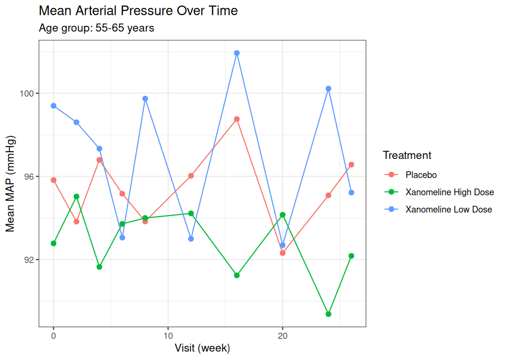
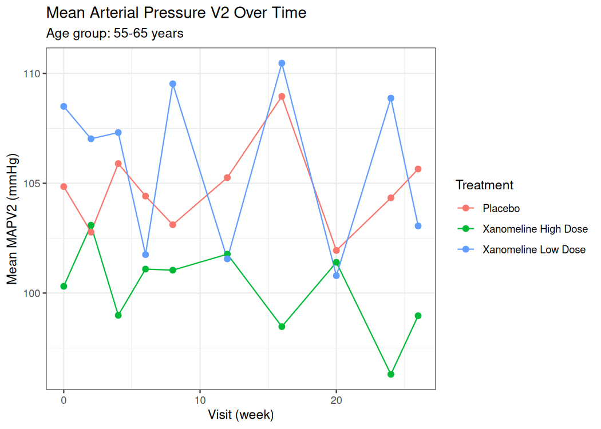
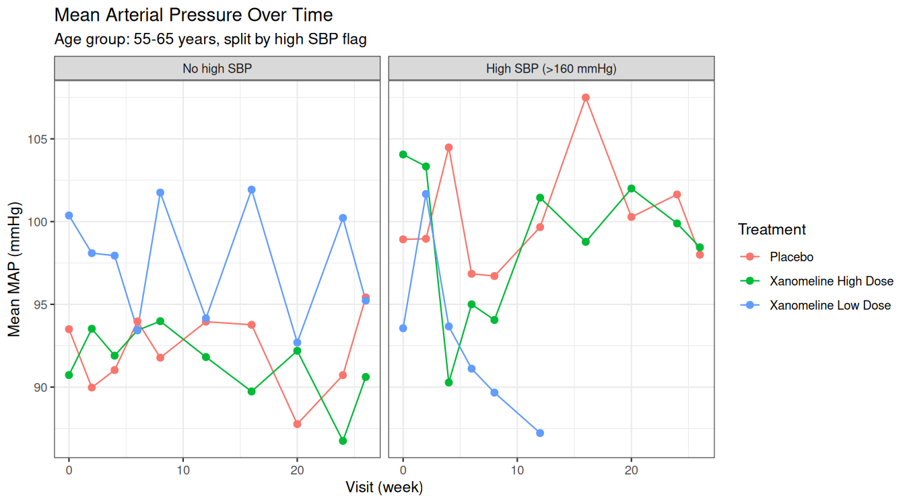
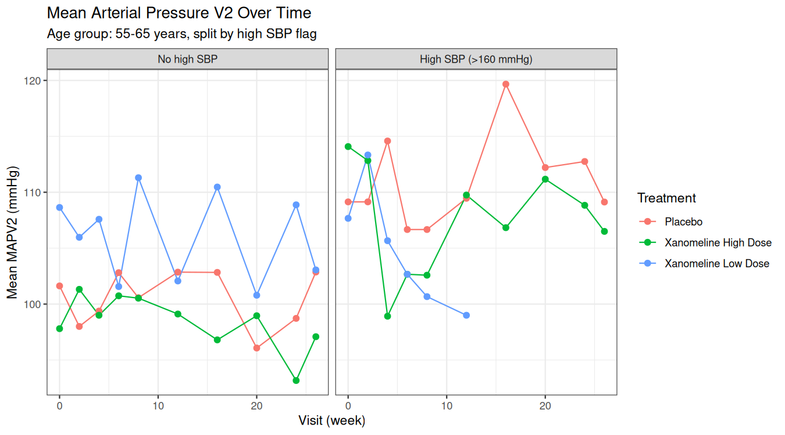

## About Me & This Workshop

::::: columns
::: {.column width="40%"}
{width="90%" fig-align="center"}
:::

::: {.column width="60%"}
I am a Senior Data Scientist working at Roche in the UK. My work
involves leading statistical programming activities in early and
late-stage clinical trials. I am also a passionate advocate for R and
Open Source, and am able to pursue these interests in my current role
as maintainer for the `{admiral}` R package.

Outside of work, I enjoy playing chess, reading, and running.
:::
:::::

Donations for sign-ups to this workshop will be used to support the Ukraine War Effort.

------------------------------------------------------------------------

## Welcome!

::: fragment
**What we'll do today:**

1.  Understand the clinical trial data flow
2.  Derive analysis variables on real-format study data
3.  Build a publication-quality visualisation
:::

::: fragment
::: {.callout-note title="Workshop materials"}
For slides, template and data, please see the workshop GitHub repo [here](https://github.com/manciniedoardo/clinical_programming_in_R_workshop).
:::
:::

::: fragment
Please install the following packages in R while we go through the background section:
```{r, eval=FALSE}
install.packages("pharmaversesdtm") # test data
install.packages("admiral") # tools for ADaM programming
install.packages("ggplot2") # plots
```
You may also want to clone the GitHub repository to your local session, or at least have it open in a browser tab to follow the slides and access the template code.
:::
------------------------------------------------------------------------

## Agenda

::: fragment
We have a lot to cover:

| Time | Topic                                                         |
|------|---------------------------------------------------------------|
| 0:00 | Background: The Clinical Trial Data Journey                   |
| 0:15 | Exercise Setup, Test data and the Packages we'll be Using     |
| 0:20 | **Exercise 1** — `ADSL` Derivations                           |
| 1:00 | **Exercise 2** — `ADVS` Derivations                           |
| 1:30 | **Exercise 3** — A Simple Plot                                |
| 1:55 | Wrap-up and Next Steps                                        |
:::

::: fragment
The background section will give you enough context to be able to do the three exercises, hopefully without overloading you with too much information!
:::

------------------------------------------------------------------------

## Background: The Clinical Trial Data Journey {.center background-color="#E8F4FD"}

------------------------------------------------------------------------

## The Clinical Trial Data Journey

::: fragment
The journey of a data point from a patient to a regulator's report is long and complex! It can loosely be categorised into four stages:
:::

::: fragment
{width="90%" fig-align="center"}
:::

::: fragment
[*Let's go through these stages one by one...*]{style="color:blue;"}
:::

------------------------------------------------------------------------

## 1. Raw Data — Where it all begins!

::: fragment
Data enters a clinical trial from many sources:

-   **eDiary / CRF (case report form)**: clinician- or patient-reported data (e.g. adverse events, concomitant medications, etc)
-   **Central labs**: blood tests, urinalysis
-   **Wearables / devices**: ECG, vital signs monitors
:::

::: fragment
:::{.callout-caution title="Raw data is messy!"}
-   Different units, different date formats
-   Inconsistent coding (a "heart attack" might be "MI", "myocardial
infarction", or "cardiac event")
-   Missing or partial dates
:::
:::

::: fragment
[*So we process raw data into...*]{style="color:blue;"}
:::

------------------------------------------------------------------------

## 2. SDTM — Standardising the data

::: fragment
**SDTM** (Study Data Tabulation Model) groups similar, related data into **domains**. Here are some below.

| Domain | Contents               |
|--------|------------------------|
| `DM`   | Demographics           |
| `VS`   | Vital Signs            |
| `LB`   | Laboratory             |
| `AE`   | Adverse Events         |
| `EX`   | Exposure (drug dosing) |

E.g. the labs domain groups all the blood tests, urinalysis etc into one dataset.
:::

::: fragment
:::{.callout-tip title="Key features of SDTM"}
- One row per observation, e.g.:
  - In `DM`: one row per patient
  - In `LB`: one row per patient per lab test per visit;
  - In `AE`: one row per patient per adverse event
- Standard variable names across all studies
- Standardised units
- Data is coded where appropriate (e.g. "Heart attack", "Cardiac arrest" → "Myocardial Infarction").
:::
:::

::: fragment
[*Let's see some examples...*]{style="color:blue;"}
:::


------------------------------------------------------------------------

## SDTM in action: `DM` & `EX`

::::: columns
::: {.column width="40%"}
::: fragment
**DM (Demographics)** — one row per patient

```{r}
#| eval: true
#| echo: false
#| class-output: "small-table"
library(pharmaversesdtm)
library(dplyr)
library(knitr)

vars <- c("USUBJID", "AGE", "RACE", "COUNTRY", "ARM")
labs <- sapply(dm[vars], attr, "label")
dm %>%
  select(all_of(vars)) %>%
  head(10) %>%
  kable(format = "html",
        col.names = paste0(vars, "<br><em>", labs, "</em>"),
        escape = FALSE,
        table.attr = 'style="font-size:0.65em"')
```
:::
:::

::: {.column width="6%"}
:::

::: {.column width="54%"}
::: fragment
**EX (Drug Exposure)** — one row per patient per dosing

```{r}
#| eval: true
#| echo: false
#| class-output: "small-table"
vars <- c("USUBJID", "EXTRT", "VISIT", "EXSTDTC", "EXDOSE")
labs <- sapply(ex[vars], attr, "label")
ex %>%
select(all_of(vars)) %>%
head(10) %>%
kable(format = "html",
col.names = paste0(vars, "<br><em>", labs, "</em>"),
escape = FALSE,
table.attr = 'style="font-size:0.65em"')
```
:::
:::
:::::

------------------------------------------------------------------------

## SDTM in action: `AE` & `VS`

::::: columns
::: {.column width="46%"}
::: fragment
**AE (Adverse Events)** — one row per patient per adverse event

```{r}
#| eval: true
#| echo: false
vars <- c("USUBJID", "AEDECOD", "AESER", "AESEV", "AESTDTC")
labs <- sapply(ae[vars], attr, "label") %>% 
  stringr::str_replace("/", "/ ")

ae %>%
  select(all_of(vars)) %>%
  head(9) %>%
  kable(format = "html",
        col.names = paste0(vars, "<br><em>", labs, "</em>"),
        escape = FALSE,
        table.attr = 'style="font-size:0.65em"')
```
:::
:::

::: {.column width="4%"}
:::

::: {.column width="50%"}
::: fragment
**VS (Vital Signs)** — one row per patient per vital sign measurement

```{r}
#| eval: true
#| echo: false
vs_vars <- c("USUBJID", "VSTESTCD", "VSORRES", "VSORRESU", "VISIT")
vs_labs <- sapply(vs[vs_vars], attr, "label")
vs %>%
  mutate(VISIT = stringr::str_replace(VISIT, "SCREENING", "SCREEN")) %>% 
  filter(
  (VSTESTCD %in% c("HEIGHT")) | (VSTESTCD %in% c("PULSE") & VSPOS %in% c("STANDING")) & VSELTM %in% c("PT1M"),
  !stringr::str_detect(VISIT, "AMBUL")
  ) %>%
select(all_of(vs_vars)) %>%
head(16) %>%
kable(format = "html",
col.names = paste0(vs_vars, "<br><em>", vs_labs, "</em>"),
escape = FALSE,
table.attr = 'style="font-size:0.65em"')
```
:::
:::
:::::

::: fragment
[*But what if we want to combine data from different domains or compute new variables for analysis?*]{style="color:blue;"}
:::

------------------------------------------------------------------------

## 3. ADaM — Analysis-ready datasets

::: fragment
**ADaM** (Analysis Data Model) transforms and combines SDTM into datasets ready for
statistical analysis.

The step from SDTM to ADaM can involve complex programming, as we are trying to __set up the data to answer the questions about safety and efficacy that the clinical trial is posing__, and this often involves combining domains.
:::

::: fragment
:::{.callout-note title="A typical example"}
We may be interested in exploring whether patients are likely to have an adverse event after being exposed to the drug. So in `ADAE` (Adverse Events Analysis Dataset) we would compute the time since last dose for every adverse event - ready to then be used in a table/graph.
:::
:::

::: fragment
:::{.callout-tip title="Key features of ADaM"}
- Analysis values and computation of change from baseline
- Derived rows (e.g. deriving mean arterial pressure from systolic and diastolic BP)
- Population flags (e.g. Safety population `SAFFL`, flagging all patients who have received a dose of study drug).
:::
:::

::: fragment
Today, we'll start directly from the ADaM-building stage. For the first part of our exercises, we will be working with two ADaM datasets - `ADSL` (Subject level ADaM, derived from `DM`) and `ADVS` (Vital Signs ADaM, derived from `VS`).
:::

::: fragment
[*But first, let's see what some typical ADAMs (`ADSL`, `ADVS` and `ADAE`) might look like...*]{style="color:blue;"}
:::

------------------------------------------------------------------------

## ADaM in action: `ADSL`

::: fragment
**ADSL (Subject-Level Analysis Dataset)** — one row per subject (derived from `DM`, `DS`, `AE`, etc.)
```{r}
#| eval: true
#| echo: false
library(pharmaverseadam)

vars <- c("USUBJID", "AGE", "SEX", "RACE", "TRT01A", "AGEGR1", "SAFFL", "RANDDT", "TRTSDTM", "TRTEDTM", "DTHDT")
labs <- sapply(adsl[vars], attr, "label")
adsl %>%
  select(all_of(vars)) %>%
  head(10) %>%
  kable(format = "html",
        col.names = paste0(vars, "<br><em>", labs, "</em>"),
        escape = FALSE,
        table.attr = 'style="font-size:0.65em"')
```
:::

------------------------------------------------------------------------

## ADaM in action: `ADAE`

::: fragment
**`ADAE` (Adverse Events Analysis Dataset)** — one row per patient per adverse event (derived from `AE` + `ADSL` + `EX`)

```{r}
#| eval: true
#| echo: false

set.seed(1)
adae %>%
  select(USUBJID, TRT01A, TRTSDTM, AEDECOD, AESTDTC, AESEV, AESER, ASTDY, TRTEMFL, LDOSEDTM) %>%
  mutate(LDOSEDTM = LDOSEDTM - floor(5*runif(1))) %>%
  head(5) %>%
  kable(format = "html",
        col.names = c(
          "USUBJID<br><em>Unique Subject Identifier</em>",
          "TRT01A<br><em>Actual Treatment for Period 01</em>",
          "TRTSDTM<br><em>Treatment Start Datetime</em>",
          "AEDECOD<br><em>Dictionary-Derived Term</em>",
          "AESTDTC<br><em>Start Date/Time of Adverse Event</em>",
          "AESER<br><em>Serious Event</em>",
          "AESEV<br><em>Severity/ Intensity</em>",
          "ASTDY<br><em>Analysis Start Relative Day</em>",
          "TRTEMFL<br><em>Treatment Emergent Flag</em>",
          "LDOSEDTM<br><em>(Dummy) Last Dose Datetime</em>"
        ),
        escape = FALSE,
        table.attr = 'style="font-size:0.65em"')
```
:::

------------------------------------------------------------------------

## ADaM in action: `ADVS`

::: fragment
**ADVS (Vital Signs Analysis Dataset)** — one row per patient per parameter per visit (derived from `VS` and `ADSL`)

```{r}
#| eval: true
#| echo: false

library(admiral)
vars <- c("USUBJID", "TRT01A", "PARAMCD", "PARAM", "DTYPE", "AVISIT", "AVISITN", "ABLFL", "AVAL", "BASE", "CHG")
labs <- sapply(advs[vars], attr, "label")
advs %>%
  mutate(VISIT = stringr::str_replace(VISIT, "SCREENING", "SCREEN")) %>% 
  filter(
  !is.na(AVISIT),
  (VSTESTCD %in% c("SYSBP", "DIABP") & VSPOS %in% c("STANDING")) & VSELTM %in% c("PT1M"),
  !stringr::str_detect(VISIT, "AMBUL"),
  AVISITN %in% c(0,2,4)
  ) %>% 
  admiral::derive_param_computed(
    by_vars = exprs(USUBJID, TRT01A, ABLFL, AVISIT, AVISITN),
    parameters = c("SYSBP", "DIABP"),
    set_values_to = exprs(
      AVAL    = (AVAL.SYSBP + AVAL.DIABP) / 2,
      PARAMCD = "MAP",
      PARAM = "Mean Arterial Pressure",
      DTYPE = "DERIVED"
    )
  ) %>% 
  select(-BASE, -CHG) %>% 
  admiral::derive_var_base(by_vars = exprs(USUBJID, PARAMCD)) %>% 
  admiral::derive_var_chg() %>% 
  select(all_of(vars)) %>%
  arrange(USUBJID, AVISITN) %>%
  head(9) %>%
  arrange(AVISITN) -> df

is_map <- df$PARAMCD == "MAP"
df <- df %>% mutate(across(everything(), as.character))
df[is_map, ] <- df[is_map, ] %>%
  mutate(across(everything(),
    ~paste0('<span style="background:#fff3cd;display:block;padding:1px 3px">', .x, '</span>')))

df %>%
  kable(format = "html",
        col.names = paste0(vars, "<br><em>", labs, "</em>"),
        escape = FALSE,
        table.attr = 'style="font-size:0.65em" id="advs-showcase"')
```
:::

::: fragment
[*And with these ADaMs, we can finally produce...*]{style="color:blue;"}
:::

------------------------------------------------------------------------

## 4. TLGs — Answering questions!

:::fragment
The final TLGs (tables, listings and graphs) that answer questions about the trial's safety and efficacy. These are provided to regulators and used in publications.
:::

::: fragment
:::{.callout-tip title="There are lots of packages to choose from!"}
Many different R packages can be used to produce TLGs. Here are some TLG examples and the packages you could use to make them.

|              | Example Contents                                  | Common R packages             |
|--------------|---------------------------------------------------|-------------------------------|
| **Tables**   | Demographics, AE counts, lab shifts               | `{gtsummary}`, `{rtables}`    |
| **Listings** | Individual patient data, AE narratives            | `{flextable}`, `{gt}`         |
| **Graphs**   | Biomarkers over time, KM curves, forest plots     | `{ggplot2}`                   |
:::
:::

::: fragment
In today's workshop's last exercise, we will focus on creating a vital signs plot.
:::

::: fragment
[*But first, let's see a typical table and plot for a clinical trial...*]{style="color:blue;"}
:::

------------------------------------------------------------------------

## TLG Example: AE Table

{width="90%" fig-align="center"}

------------------------------------------------------------------------

## TLG Example: Pharmacokinetic Plot

{width="90%" fig-align="center"}

------------------------------------------------------------------------

## Exercise Setup, Test Data & Packages {.center background-color="#E8F4FD"}

------------------------------------------------------------------------

## Exercise Setup and Test Data

::: fragment
Welcome to the interactive part of the workshop! Here we will focus on:

- Creating two ADaM datasets, `ADSL` (Subject-level) and `ADVS` (Vital Signs) - *Exercises 1 and 2*;
- Creating a plot of Mean Arterial Pressure over time using these datasets - *Exercise 3*.
:::

::: fragment
We will be using test data today. The source for the test data is the `{pharmaversesdtm}` package. This is the same test data that has been used for the examples in the background section. 
:::

::: fragment
:::{.callout-tip title="Where does this data come from?"}
`{pharmaversesdtm}` is one of the package maintained by members of the [pharmaverse](https://pharmaverse.org/), which is an Open-Source effort to set up a toolset for End-to-End clinical reporting in R. You can access the test datasets like so:

```{r}
#| code-line-numbers: true
library(pharmaversesdtm)

# Demographics
pharmaversesdtm::dm

# Vital signs
pharmaversesdtm::vs
```
:::
:::

::: fragment
Luckily, you won't have to create anything from scratch: the `templates` folder in the [GitHub repo](https://github.com/manciniedoardo/clinical_programming_in_R_workshop) contains starting programs on which the exercises are based.
:::

------------------------------------------------------------------------

## Packages

::: fragment
As well as the `{tidyverse}` suite of packages, today we will be using another pharmaverse package, `{admiral}`, to help us create our ADaM datasets.

```{r}
library(admiral)
```
:::

::: fragment
:::{.callout-note title="What's the idea behind {admiral}"}
**Core idea:** `{admiral}` `derive_*()` functions can be chained together with `{dplyr}` functions in a series of blocks, each modifying a dataset in some way, e.g. adding variables or rows.

Take a look at the two blocks below:
```{r}
#| code-line-numbers: true
adsl_start <- dm %>%
  ## Derive treatment arm variables
  mutate(TRT01P = ARM, TRT01A = ACTARM) %>%
  ## Derive treatment start datetime / date 
  derive_vars_merged(
    dataset_add = ex,
    filter_add = (EXDOSE > 0 | (EXDOSE == 0 & str_detect(EXTRT, "PLACEBO"))) & !is.na(EXSTDTM),
    by_vars = exprs(STUDYID, USUBJID),
    new_vars = exprs(TRTSDTM = EXSTDTM),
    order = exprs(EXSTDTM, EXSEQ),
    mode = "first",             
  )
```
Notice in particular the use of `exprs()` to pass column names, and `by_vars` to split the dataset into groups.
:::
:::

::: fragment
We'll be using `{ggplot2}` for our plot... but you're all probably familiar with that already!
:::

------------------------------------------------------------------------

## Exercise 1: Working with `ADSL` {.center background-color="#E8F4FD"}

------------------------------------------------------------------------

## Exercise 1: Working with `ADSL`

::: fragment
[Let's remind ourselves of what we can find in the `ADSL` dataset.]{style="color:blue;"}
:::

::: fragment 
`ADSL` contains **one row per patient** - so the number of rows of the dataset is equal to the total number of patients in the trial.
:::

::: fragment
Here are some of the key variables in the `ADSL` dataset:

| Variable             | Description                                                                |
|----------------------|----------------------------------------------------------------------------|
| `USUBJID`            | Unique subject identifier (i.e. an anonymous code that labels the patient) |
| `AGE`, `SEX`, `RACE` | Demographics                                                               |
| `TRT01A`             | Actual treatment arm (i.e. what drug the patient is taking)                |
| `TRTSDT` / `TRTEDT`  | Treatment start / end date                                                 |
| `AGEGR1`             | Age group (categorical)                                                    |
| `SAFFL`              | Safety population flag (i.e. if the patient has been dosed yet)            |
:::

::: fragment
[Let's open `templates/ad_adsl.R` and see how a simple `ADSL` is created...]{style="color:blue;"}
::: 

------------------------------------------------------------------------

## Exercise 1a — New Age Group (`AGEGR2`) {auto-animate="true"}

**Task:** Your statistician is interested to learn the age ranges of the patients in your trial to understand whether the ranges of interest are appropriately represented. To support that request, add a variable `AGEGR2` to `ADSL` with the following categories:

::: {.small-table}
| Condition       | Value     |
|-----------------|-----------|
| `AGE < 55`      | `"<55"`   |
| `55 ≤ AGE ≤ 65` | `"55-65"` |
| `AGE > 65`      | `">65"`   |
:::

How many patients are in each `AGEGR2` group?

:::{.callout-tip title="Hints"}
- Follow the same pattern as `AGEGR1`.
:::

------------------------------------------------------------------------

## Exercise 1a — New Age Group (`AGEGR2`) {auto-animate="true"}

**Solution:**
```{r}
#| code-line-numbers: true
adsl <- adsl %>%
  mutate(
    AGEGR2 = case_when(
      AGE < 55             ~ "<55",
      between(AGE, 55, 65) ~ "55-65",
      AGE > 65             ~ ">65",
      TRUE                 ~ NA_character_
    )
  )

adsl %>%
  group_by(AGEGR2) %>%
  summarise(Count = n())

# Answer: <55: 5 patients; 55-65: 41 patients; >65: 260 patients
```

------------------------------------------------------------------------

## Exercise 1b — High Systolic Blood Pressure Flag (`HISOBPFL`) {auto-animate="true"}

**Task:** Your safety scientist is interested in patients who have high systolic blood pressure (SBP) readings and may want to see some future TLGs generated for only those patients. Ahead of this requirement, create a new variable `HISOBPFL` in `ADSL` that flags patients who have *any* SBP measurement \> 160 mmHg. The flag should be `"Y"` if the patient has at least one SBP reading > 160, and `"N"` otherwise.

How many patients have a high SBP reading?

:::{.callout-tip title="Hints"}
- `admiral::derive_var_merged_exist_flag()` is your friend! The function creates a flag in a dataset based on whether records exist in another dataset. Check out the function's documentation and examples with `?derive_var_merged_exist_flag`.
:::

------------------------------------------------------------------------

## Exercise 1b — High Systolic Blood Pressure Flag (`HISOBPFL`) {auto-animate="true"}

**Solution:**
```{r}
#| code-line-numbers: true
adsl <- adsl %>%
  derive_var_merged_exist_flag(
    dataset_add   = vs,
    by_vars       = exprs(STUDYID, USUBJID),
    new_var       = HISOBPFL,
    condition     = VSTESTCD == "SYSBP" & VSSTRESN > 160,
    false_value   = "N",
    missing_value = "N"
  )

# Check results:
adsl %>% count(HISOBPFL)

# Answer: 87 patients have an SBP > 160 mmHg
```

------------------------------------------------------------------------

## Exercise 2: Working with `ADVS` {.center background-color="#E8F4FD"}

------------------------------------------------------------------------

## Exercise 2: Working with `ADVS`

::: fragment
:::{.callout-note title="ADSL"}
- This exercise will use the `ADSL` dataset you created in Exercise 1. You can also download it from the GitHub repo if you haven't completed the exercise.
:::
:::

::: fragment
[Let's remind ourselves of what we can find in the `ADVS` dataset.]{style="color:blue;"}
:::

::: fragment 
`ADVS` contains **one row per patient per visit per vital sign measurement** - so each patient has multiple rows in the dataset 
(e.g pulse/blood pressure/weight at baseline, blood pressure at Week 2, Week 4, etc.).
:::

::: fragment
Here are some of the key variables in the `ADVS` dataset:

::: {.small-table}
| Variable             | Description                | Example                            |
|----------------------|----------------------------|------------------------------------|
| `USUBJID`            | Unique subject identifier  | `01-718-1371`                      |
| `PARAMCD`            | Short code for the test    | `"SYSBP"`, `"DIABP"`, `"PULSE"`    |
| `PARAM`              | Long name for the test     | `"Systolic blood pressure (mmHg)"` |
| `AVISIT`             | Analysis Visit             | `"BASELINE"`, `"WEEK 2"`           |
| `VSTPT`              | Timepoint for measurement  | `"AFTER LYING DOWN FOR 5 MINUTES"`, `"AFTER STANDING FOR 1 MINUTE"`, `"AFTER STANDING FOR 3 MINUTES"`|
| `AVAL`               | Numeric result of the test | `118`, `76`, `NA`                  |
| `AVALU`              | Unit of measurement        | `"mmHg"`, `"beats/min"`            |
| `VSSTAT`             | Completion status          | `"NOT DONE"` if skipped            |
:::
:::

::: fragment
[Unlike `ADSL`, `ADVS` can have whole new (derived) rows with measurements constructed as a combination of other measurements...]{style="color:blue;"}
:::

------------------------------------------------------------------------

## Exercise 2: Working with `ADVS`

::: fragment
As we saw before, Mean Arterial Pressure is a **derived parameter** — it is calculated
from two collected parameters (SBP and DBP):

$$\text{MAP} = \frac{2 \times \text{DBP} + \text{SBP}}{3}$$
:::
::: fragment
Since MAP is a common measurement to compute, `{admiral}` provides a dedicated function for this common derivation:

```{r}
#| code-line-numbers: true
advs <- advs %>%
  derive_param_map(
    by_vars       = exprs(STUDYID, USUBJID, !!!adsl_vars,
                          VISIT, VISITNUM, ADT, ADY, VSTPT, VSTPTNUM),
    set_values_to = exprs(PARAMCD = "MAP"),
    get_unit_expr = VSSTRESU,
    filter        = VSSTAT != "NOT DONE" | is.na(VSSTAT)
  )
```
:::

::: fragment
:::{.callout-note title="Note for later"}
`derive_param_map()` is a wrapper to the more generic `derive_param_computed()`.
:::
::: callout-warning
Without `filter = VSSTAT != "NOT DONE" | is.na(VSSTAT)`, uncollected
measurements are passed to the formula and produce `NA`.
:::
:::

::: fragment
[Let's open `templates/ad_advs.R` and see how a simple `ADVS` is created - in particular the derivation of the mean arterial pressure...]{style="color:blue;"}
::: 

------------------------------------------------------------------------

## Exercise 2a — Derive `MAPV2` (custom formula) {auto-animate="true"}

**Task:** A particularly enterprising safety scientist on your trial wants to test out a new formula for deriving MAP using the arithmetic mean:

$$\text{MAPV2} = \frac{\text{SBP} + \text{DBP}}{2}$$
Ahead of analysis, add a `"MAPV2"` parameter to the dataset that calculates this new MAP at each timepoint using `admiral::derive_param_computed()` with `parameters = c("SYSBP", "DIABP")`.

Which patient has the highest MAPV2 and at what visit?

:::{.callout-tip title="Tip"}
- Example 1a in the reference page `?derive_param_computed` shows how to compute generic MAP using `derive_param_computed()`.
- You can copy the `by_vars` and `filter` arguments from the `derive_param_map()` call for the standard MAP.
- Remember to update the parameter lookup table at the top of the script!
:::

------------------------------------------------------------------------

## Exercise 2a — Derive `MAPV2` (custom formula) {auto-animate="true"}

**Solution:**

```{r}
#| code-line-numbers: true
param_lookup <- tibble::tribble(
  ~VSTESTCD, ~PARAMCD,                            ~PARAM,
  "HEIGHT",  "HEIGHT",                    "Height (cm)",
  "WEIGHT",  "WEIGHT",                    "Weight (kg)",
  "TEMP",    "TEMP",                     "Temp (deg C)",
  "SYSBP",   "SYSBP",  "Systolic Blood Pressure (mmHg)",
  "DIABP",   "DIABP", "Diastolic Blood Pressure (mmHg)",
  "PULSE",   "PULSE",          "Pulse Rate (beats/min)",
  "MAP",      "MAP",    "Mean Arterial Pressure (mmHg)",
  "MAPV2",  "MAPV2",  "Mean Arterial Pressure V2 (mmHg)" # new line
)

advs <- advs %>% 
  derive_param_computed(
    by_vars       = exprs(STUDYID, USUBJID, !!!adsl_vars,
                        VISIT, VISITNUM, ADT, ADY, VSTPT, VSTPTNUM),
   parameters    = c("SYSBP", "DIABP"),
    set_values_to = exprs(
      AVAL    = (AVAL.SYSBP + AVAL.DIABP) / 2,
      PARAMCD = "MAPV2"
    )
  )

# Highest MAPV2 is 158.0 mmHg for 01-718-1355 at Week 24 visit (timepoint: AFTER STANDING FOR 1 MINUTE)
```

::: fragment
[Now let's put everything into practice with a visualisation!]{style="color:blue;"}
:::

------------------------------------------------------------------------

## Exercise 3: A Simple Visualisation {.center background-color="#E8F4FD"}

------------------------------------------------------------------------

## Exercise 3: A Simple Visualisation {auto-animate="true"}

:::{.callout-note title="ADVS"}
- This exercise will use the `ADVS` dataset you created in Exercise 2. You can also download it from the GitHub repo if you haven't completed the exercise.
:::

**Task:** Starting from **`templates/g_vs_map.R`**, create two plots of mean `"MAP"`/`"MAPV2"` over time (use visit number `AVISITN`), split by treatment arm (`TRT01A`) and restricted to patients aged **55-65**. Optional: facet each plot into two, splitting by patients who have high systolic blood pressure (`HISOBPFL == "Y"`) and those who do not (`HISOBPFL == "N"`).

You'll need to pre-process `ADVS` as follows first to compute the data points for the plot:

```{r}
map_summary <- advs %>%
  filter(PARAMCD == "MAP" & AGEGR2 %in% c("55-65") & !is.na(AVISITN)) %>%
  group_by(AVISITN, AVISIT, TRT01A) %>%
  summarise(mean_aval = mean(AVAL, na.rm = TRUE), .groups = "drop")
```

------------------------------------------------------------------------

## Exercise 3: A Simple Visualisation {auto-animate="true"}

**Solution:**
```{r}
#| code-line-numbers: true
ggplot(map_summary, aes(x = AVISITN, y = mean_aval,
                        colour = TRTA, group = TRTA)) +
  geom_line() + geom_point(size = 2) +
  labs(title = "Mean Arterial Pressure Over Time",
       subtitle = "Age group: 55-65 years",
       x = "Visit (week)", y = "Mean MAP (mmHg)", colour = "Treatment") +
  theme_bw()
```

Repeat for `PARAMCD == "MAPV2"`.

------------------------------------------------------------------------

## Exercise 3: Solution Plots

::: fragment
::::: columns
::: {.column width="50%"}
{width="100%" fig-align="center"}
:::

::: {.column width="50%"}
{width="100%" fig-align="center"}
:::
:::::
:::

::: fragment
[**🤔Open question:** How could you further enhance/improve these plots?]{style="color:blue;"}
:::
------------------------------------------------------------------------

## Exercise 3 (Optional): Faceted by `HISOBPFL`

::: fragment
**Solution:**
```{r}
#| code-line-numbers: true
ggplot(map_summary, aes(x = AVISITN, y = mean_aval,
                        colour = TRT01A, group = TRT01A)) +
  geom_line() + geom_point(size = 2) +
  facet_wrap(~HISOBPFL) +
  labs(title = "Mean Arterial Pressure Over Time",
       subtitle = "Age group: 55-65 years, split by high SBP flag",
       x = "Visit (week)", y = "Mean MAP (mmHg)", colour = "Treatment") +
  theme_bw()
```

Repeat for `PARAMCD == "MAPV2"`. See `solutions/solution_g_vs_map_faceted.R` for the full solution.
:::

::: fragment
::::: columns
::: {.column width="50%"}
{width="100%" fig-align="center"}
:::

::: {.column width="50%"}
{width="100%" fig-align="center"}
:::
:::::
:::

------------------------------------------------------------------------

## Wrap-up {.center background-color="#E8F4FD"}

------------------------------------------------------------------------

## Summary and links for further reading

::: fragment
**What we learned today:**
:::

::: fragment
- The Clinical Data Pipeline (Raw → SDTM → ADaM → TLGs)...
:::

::: fragment
- Some pharmaverse packages that help support it
:::

::: fragment
- Examples of SDTM and ADaM datasets
  - `DM`, `VS`, `AE`, `EX`
  - `ADSL`, `ADVS`, `ADAE`
:::

::: fragment
- How to add variables to `ADSL` and parameters to `ADVS` to support analysis
:::

::: fragment
- How to use our datasets to generate a simple plot.
:::

::: fragment
**To go further:**
:::

::: fragment
- **Pharmaverse** — [https://pharmaverse.org/](https://pharmaverse.org/)
:::

::: fragment
- More in-depth examples - [https://pharmaverse.github.io/examples/](https://pharmaverse.github.io/examples/)
:::

------------------------------------------------------------------------

## Thank You 🙏 {.center}

Questions? Feedback?
